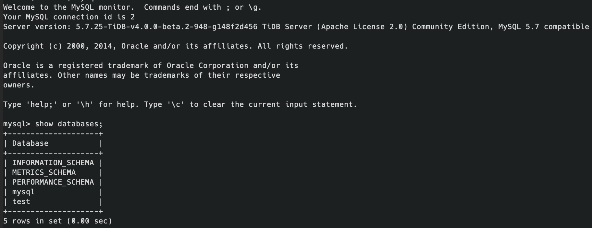

## 安装

### 下载源代码

找到github地址clone,很顺利.

### 编译

下载完成以后每个目录下执行命令`make`.tidb/pd顺利执行完毕,在分别生成`bin/tidb-server`和`bin/pd-server`两个可执行文件.tikv有点折腾,在macos上面编译zlib时出现错误:

```
argo:warning=src/zlib/gzlib.c:214:15: error: implicitly declaring library function 'snprintf' with type 'int (char *, unsigned long, const char *, ...)' [-Werror,-Wimplicit-function-declaration]
  cargo:warning=        (void)snprintf(state->path, len + 1, "%s", (const char *)path);
```

google未果,果断换到virtualbox中的linux环境编译(在公司的linux环境已经编译过了),搞定!顺利生成可执行文件`target/release/tikv-server`.

## 启动

因为使用了virtualbox虚拟机,因此必须的使用虚拟机的网络进行通行.虚拟机ip:192.168.56.101,主机的虚拟网卡地址:192.168.56.1.

### tikv

#### 配置

修改关键三个配置:

```
######### config3.toml ############
[server]
addr = "192.168.56.101:20160"
[storage]
data-dir = "./store"
[pd]
endpoints = ["192.168.56.1:2379"]

######### config3.toml ############
[server]
addr = "192.168.56.101:20161"
[storage]
data-dir = "./store1"
[pd]
endpoints = ["192.168.56.1:2379"]

######### config3.toml ############
[server]
addr = "192.168.56.101:20162"
[storage]
data-dir = "./store2"
[pd]
endpoints = ["192.168.56.1:2379"]
```

#### 启动命令

```
./tikv-server -C config1.toml
./tikv-server -C config2.toml
./tikv-server -C config3.toml
```

### pd

#### 配置

修改关键配置

```
client-urls = "http://192.168.56.1:2379"
peer-urls = "http://192.168.56.1:2380"
initial-cluster = "pd=http://192.168.56.1:2380"
```

#### 启动命令

```
./pd-server -config config.toml
```

### tidb

#### 配置

```
advertise-address =  "192.168.56.1"
```

#### 启动命令

```
./tidb-server -config config.toml
```

### 测试

命令:`mysql -h 192.168.56.1 -P 4000 -uroot`.

输出:



:)

## 打印事物日志

### 准备SQL脚本

```
CREATE DATABASE `db1`;
USE `db1`;
DROP TABLE IF EXISTS `table1`;
CREATE TABLE `table1` (
  `id` int(11) unsigned NOT NULL AUTO_INCREMENT,
  `name` varchar(128) NOT NULL DEFAULT '',
  `age` int(11) NOT NULL DEFAULT 0,
  PRIMARY KEY (`id`)
) ENGINE=InnoDB DEFAULT CHARSET=utf8mb4 COLLATE=utf8mb4_bin AUTO_INCREMENT=1;
```

### 查找事务逻辑代码

从`tide-server/main.go`中出发,按照执行逻辑寻找事务代码.发现事务逻辑有点复杂.感觉需要查阅官方或者第三方文档.

按照常规思路事务开启一般会有Begin语句,按此找到源码文件`store/tikv/kv.go`中方法`tikvStore::Begin`.按此逻辑,打印"hello transaction",执行`go run...`启动的时候,就有好多,周期性打印.感觉好诡异啊!

```
func (s *tikvStore) Begin() (kv.Transaction, error) {
        fmt.Println("hello transaction")
        txn, err := newTiKVTxn(s)
        if err != nil {
                return nil, errors.Trace(err)
        }
        return txn, nil
}
```

通过打印调用栈发现有一些ddl以及统计相关的后台job在操作.

结合第三方文档以及实验确定应该是上面那个地方.

实验姿势:在控制台输入两种SQL脚本,一种是开启事务,一种没开启.发现开启的会打印,不开启的不会打印.

开启事务SQL脚本

```
begin;
insert into table1 values(1,"n1",1);
commit;
```

未开启事务SQL脚本

```
insert into table1 values(1,"n1",1);
```

## 参考资料

https://www.bilibili.com/video/BV1ox411R7EA?from=search&seid=18353943428185179476

https://docs.pingcap.com/zh/tidb/v3.0/transaction-overview

https://pingcap.com/blog-cn/best-practice-optimistic-transaction/