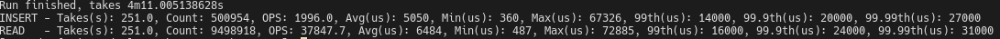
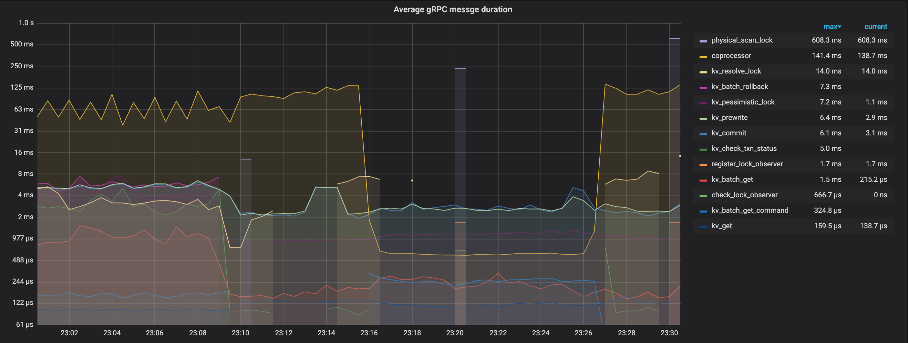
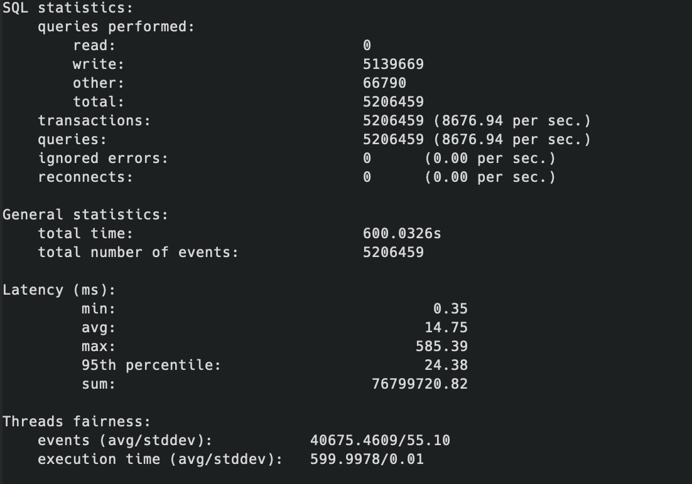

## 配置

部署拓扑图如下：


集群部署在4台机器上面。tdib和pd一起部署在**node1**结点。tikv部署了三个结点，分别是**kv-node1**、**kv-node2**、**kv-node3**.

它们的配置如下：

| 结点     | 配置详情                                                     |
| -------- | ------------------------------------------------------------ |
| node1    | CPU：8核，内存：16 GiB，磁盘规格型号：200GiB (11800 IOPS)，单盘IOPS性能上限5万 |
| kv-node1 | CPU：8核，内存：32 GiB，磁盘规格型号：256GiB (14600 IOPS)，单盘IOPS性能上限5万 |
| kv-node2 | CPU：8核，内存：32 GiB，磁盘规格型号：256GiB (14600 IOPS)，单盘IOPS性能上限5万 |
| kv-node3 | CPU：8核，内存：32 GiB，磁盘规格型号：256GiB (14600 IOPS)，单盘IOPS性能上限5万 |

TiDB Dashboard中集群信息如下：

### 实例


### 主机


### 服务配置

#### tidb

```
tidb:
    log.slow-threshold: 300
    binlog.enable: false
    binlog.ignore-error: false
    mem-quota-query: 5368709120
```

#### tikv

```
tikv:
    readpool.storage.use-unified-pool: false
    readpool.coprocessor.use-unified-pool: true
```

## 测试

### go-ycsb

#### workloada

##### 结果


##### 监控

tidb-qps


tidb-duration


tikv-cluster-qps


tikv-cluster-CPU


tikv-grpc-qps


tikv-grpc-duration


tikv-grpc-avg-duration


##### 分析

#### workloadb

##### 结果


##### 监控

tidb-qps


tidb-duration


tikv-cluster-qps


tikv-cluster-CPU


tikv-grpc-qps


tikv-grpc-duration


tikv-grpc-avg-duration


##### 分析

#### workloadc

##### 结果


##### 监控

tidb-qps


tidb-duration


tikv-cluster-qps


tikv-cluster-CPU


tikv-grpc-qps


tikv-grpc-duration


tikv-grpc-avg-duration


##### 分析

#### workloadd

##### 结果



##### 监控

tidb-qps


tidb-duration


tikv-cluster-qps


tikv-cluster-CPU


tikv-grpc-qps


tikv-grpc-duration


tikv-grpc-avg-duration


##### 分析

#### workloade

##### 结果


##### 监控

tidb-qps


tidb-duration


tikv-cluster-qps


tikv-cluster-CPU


tikv-grpc-qps


tikv-grpc-duration


tikv-grpc-avg-duration


##### 分析

#### workloadf

##### 结果


##### 监控

tidb-qps


tidb-duration


tikv-cluster-qps


tikv-cluster-CPU


tikv-grpc-qps


tikv-grpc-duration


tikv-grpc-avg-duration


##### 分析

### sysbench

#### oltp_point_select

##### 结果


##### 监控

tidb-qps


tidb-duration


tikv-cluster-qps


tikv-cluster-CPU


tikv-grpc-qps


tikv-grpc-duration


tikv-grpc-avg-duration


##### 分析

#### oltp_read_only

##### 结果


##### 监控

tidb-qps


tidb-duration


tikv-cluster-qps


tikv-cluster-CPU


tikv-grpc-qps


tikv-grpc-duration


tikv-grpc-avg-duration



##### 分析

#### oltp_update_index

##### 结果



##### 监控

tidb-qps


tidb-duration


tikv-cluster-qps


tikv-cluster-CPU


tikv-grpc-qps


tikv-grpc-duration


tikv-grpc-avg-duration


##### 分析

### go-tpc

#### tpc-c

##### 结果


##### 监控

tidb-qps


tidb-duration


tikv-cluster-qps


tikv-cluster-CPU


tikv-grpc-qps


tikv-grpc-duration


tikv-grpc-avg-duration


##### 分析

#### tpc-h

##### 结果


##### 监控

tidb-qps


tidb-duration


tikv-cluster-qps


tikv-cluster-CPU


tikv-grpc-qps


tikv-grpc-duration


tikv-grpc-avg-duration


##### 分析