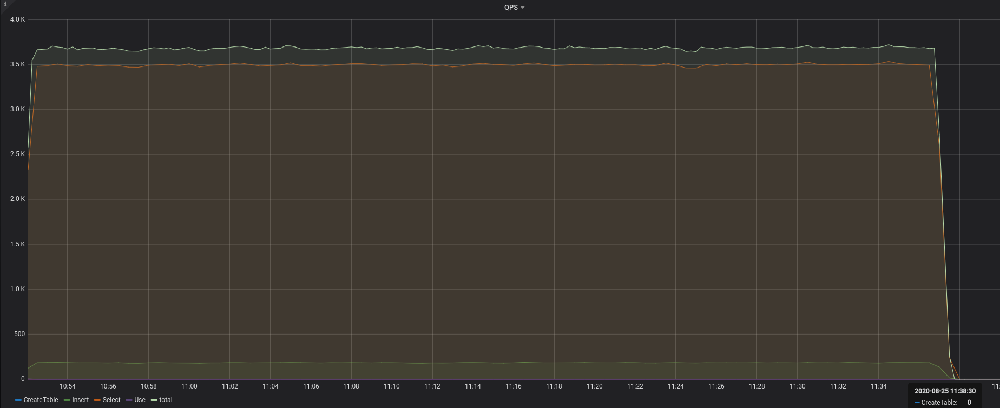

- [配置](#%E9%85%8D%E7%BD%AE)
  * [实例](#%E5%AE%9E%E4%BE%8B)
  * [主机](#%E4%B8%BB%E6%9C%BA)
  * [服务配置](#%E6%9C%8D%E5%8A%A1%E9%85%8D%E7%BD%AE)
    + [tidb](#tidb)
    + [tikv](#tikv)
- [测试](#%E6%B5%8B%E8%AF%95)
  * [go-ycsb](#go-ycsb)
    + [workloada](#workloada)
      - [结果](#%E7%BB%93%E6%9E%9C)
      - [监控](#%E7%9B%91%E6%8E%A7)
      - [分析](#%E5%88%86%E6%9E%90)
    + [workloadb](#workloadb)
      - [结果](#%E7%BB%93%E6%9E%9C-1)
      - [监控](#%E7%9B%91%E6%8E%A7-1)
      - [分析](#%E5%88%86%E6%9E%90-1)
    + [workloadc](#workloadc)
      - [结果](#%E7%BB%93%E6%9E%9C-2)
      - [监控](#%E7%9B%91%E6%8E%A7-2)
      - [分析](#%E5%88%86%E6%9E%90-2)
    + [workloadd](#workloadd)
      - [结果](#%E7%BB%93%E6%9E%9C-3)
      - [监控](#%E7%9B%91%E6%8E%A7-3)
      - [分析](#%E5%88%86%E6%9E%90-3)
    + [workloade](#workloade)
      - [结果](#%E7%BB%93%E6%9E%9C-4)
      - [监控](#%E7%9B%91%E6%8E%A7-4)
      - [分析](#%E5%88%86%E6%9E%90-4)
    + [workloadf](#workloadf)
      - [结果](#%E7%BB%93%E6%9E%9C-5)
      - [监控](#%E7%9B%91%E6%8E%A7-5)
      - [分析](#%E5%88%86%E6%9E%90-5)
  * [sysbench](#sysbench)
    + [oltp_point_select](#oltp_point_select)
      - [结果](#%E7%BB%93%E6%9E%9C-6)
      - [监控](#%E7%9B%91%E6%8E%A7-6)
      - [分析](#%E5%88%86%E6%9E%90-6)
    + [oltp_read_only](#oltp_read_only)
      - [结果](#%E7%BB%93%E6%9E%9C-7)
      - [监控](#%E7%9B%91%E6%8E%A7-7)
      - [分析](#%E5%88%86%E6%9E%90-7)
    + [oltp_update_index](#oltp_update_index)
      - [结果](#%E7%BB%93%E6%9E%9C-8)
      - [监控](#%E7%9B%91%E6%8E%A7-8)
      - [分析](#%E5%88%86%E6%9E%90-8)
  * [go-tpc](#go-tpc)
    + [tpc-c](#tpc-c)
      - [结果](#%E7%BB%93%E6%9E%9C-9)
      - [监控](#%E7%9B%91%E6%8E%A7-9)
      - [分析](#%E5%88%86%E6%9E%90-9)
    + [tpc-h](#tpc-h)
      - [结果](#%E7%BB%93%E6%9E%9C-10)
      - [监控](#%E7%9B%91%E6%8E%A7-10)
      - [分析](#%E5%88%86%E6%9E%90-10)


## 配置

部署拓扑图如下：


集群部署在4台机器上面。tdib和pd一起部署在**node1**结点。tikv部署了三个结点，分别是**kv-node1**、**kv-node2**、**kv-node3**.

它们的配置如下：

| 结点     | 配置详情                                                     |
| -------- | ------------------------------------------------------------ |
| node1    | CPU：8核，内存：16 GiB，磁盘规格型号：200GiB (11800 IOPS)，单盘IOPS性能上限5万 |
| kv-node1 | CPU：8核，内存：32 GiB，磁盘规格型号：256GiB (14600 IOPS)，单盘IOPS性能上限5万 |
| kv-node2 | CPU：8核，内存：32 GiB，磁盘规格型号：256GiB (14600 IOPS)，单盘IOPS性能上限5万 |
| kv-node3 | CPU：8核，内存：32 GiB，磁盘规格型号：256GiB (14600 IOPS)，单盘IOPS性能上限5万 |

TiDB Dashboard中集群信息如下：

### 实例


### 主机


### 服务配置

#### tidb

```
tidb:
    log.slow-threshold: 300
    binlog.enable: false
    binlog.ignore-error: false
    mem-quota-query: 5368709120
```

#### tikv

```
tikv:
    readpool.storage.use-unified-pool: false
    readpool.coprocessor.use-unified-pool: true
```

## 测试

### go-ycsb

#### workloada

##### 结果


##### 监控

tidb-qps


tidb-duration


tikv-cluster-qps


tikv-cluster-CPU


tikv-grpc-qps


tikv-grpc-duration


tikv-grpc-avg-duration


##### 分析

根据[profile](go-ycsb/workloada/profiling/profiling_6_17_tidb_172_21_128_57_4000175210179.svg),tidb主要时间花在了和tikv之间的io上面.

同样,根据[profile](go-ycsb/workloada/profiling/profiling_6_18_tikv_172_21_128_58_20160572803910.svg)文件,tikv主要花在数据解压和网络io上面.

#### workloadb

##### 结果


##### 监控

tidb-qps


tidb-duration


tikv-cluster-qps


tikv-cluster-CPU


tikv-grpc-qps


tikv-grpc-duration


tikv-grpc-avg-duration


##### 分析

**TODO**

#### workloadc

##### 结果


##### 监控

tidb-qps


tidb-duration


tikv-cluster-qps


tikv-cluster-CPU


tikv-grpc-qps


tikv-grpc-duration


tikv-grpc-avg-duration


##### 分析

**TODO**

#### workloadd

##### 结果


##### 监控

tidb-qps


tidb-duration


tikv-cluster-qps


tikv-cluster-CPU


tikv-grpc-qps


tikv-grpc-duration


tikv-grpc-avg-duration


##### 分析

**TODO**

#### workloade

##### 结果


##### 监控

tidb-qps



tidb-duration


tikv-cluster-qps


tikv-cluster-CPU


tikv-grpc-qps


tikv-grpc-duration


tikv-grpc-avg-duration


##### 分析

**TODO**

#### workloadf

##### 结果


##### 监控

tidb-qps


tidb-duration


tikv-cluster-qps


tikv-cluster-CPU


tikv-grpc-qps


tikv-grpc-duration


tikv-grpc-avg-duration


##### 分析

**TODO**

### sysbench

#### oltp_point_select

##### 结果


##### 监控

tidb-qps


tidb-duration


tikv-cluster-qps


tikv-cluster-CPU


tikv-grpc-qps


tikv-grpc-duration


tikv-grpc-avg-duration


##### 分析

根据[profile](sysbench/oltp_point_select/profiling/profiling_3_3_tidb_172_21_128_57_4000220048405.svg),tidb主要时间花在了io/gc/对象分配上面.

根据[profile](sysbench/oltp_point_select/profiling/profiling_3_4_tikv_172_21_128_58_20160247113506.svg),tikv主要时间花在了发送网络io上面.

#### oltp_read_only

##### 结果


##### 监控

tidb-qps


tidb-duration


tikv-cluster-qps


tikv-cluster-CPU


tikv-grpc-qps


tikv-grpc-duration


tikv-grpc-avg-duration


##### 分析

根据[profile](sysbench/oltp_read_only/profiling/profiling_5_12_tidb_172_21_128_57_4000110973406.svg),tidb主要时间花在了网络io/gc/对象分配/执行计划优化上面.

根据[profile](sysbench/oltp_read_only/profiling/profiling_5_13_tikv_172_21_128_58_20160112095141.svg),tikv主要时间花在了网络io/数据解压上面.

#### oltp_update_index

##### 结果


##### 监控

tidb-qps


tidb-duration


tikv-cluster-qps


tikv-cluster-CPU


tikv-grpc-qps


tikv-grpc-duration


tikv-grpc-avg-duration


##### 分析

根据[profile](sysbench/oltp_update_index/profiling/profiling_4_7_tidb_172_21_128_57_4000510918067.svg),tidb主要时间花在了commit相关的网络io/对象分配上面.

根据[profile](sysbench/oltp_update_index/profiling/profiling_4_8_tikv_172_21_128_58_20160694032246.svg),tikv主要时间花在了网络io/数据解压上面.

### go-tpc

#### tpc-c

##### 结果


##### 监控

tidb-qps


tidb-duration


tikv-cluster-qps


tikv-cluster-CPU


tikv-grpc-qps


tikv-grpc-duration


tikv-grpc-avg-duration


##### 分析

根据[profile](go-tpc/tpc-c/profiling/profiling_18_77_tidb_172_21_128_57_4000364503200.svg),tidb主要时间花在了执行sql语句/对象分配上面.

根据[profile](go-tpc/tpc-c/profiling/profiling_18_77_tidb_172_21_128_57_4000364503200.svg),tikv主要时间花在了数据解压上面.

#### tpc-h

##### 结果


##### 监控

tidb-qps


tidb-duration


tikv-cluster-qps


tikv-cluster-CPU


tikv-grpc-qps


tikv-grpc-duration


tikv-grpc-avg-duration


##### 分析